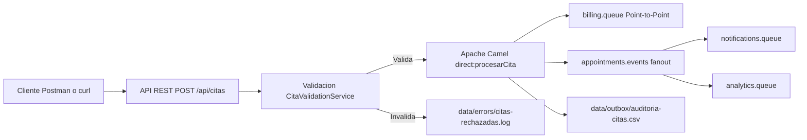

# Examen Practico Progreso 2

## Portada

**Nombre de la universidad:** Universidad de Las Americas  
**Asignatura:** Integracion de Sistemas  
**Evaluacion:** Examen Practico Progreso 2  
**Estudiante:** Jonathan Granja  
**Fecha:** 4 de junio de 2026  
**Paralelo o seccion:** No especificado

## Repositorio GitHub de la solucion

Repositorio GitHub de la solucion: https://github.com/Jonalex1804/progreso2-integracion-granja-jonathan

> Reemplazar el enlace anterior si el repositorio publico se crea con otro usuario de GitHub.

## Identificacion del problema de integracion

El problema principal del caso Salud360 es que varios sistemas operativos trabajan de forma aislada y los datos de citas se copian manualmente entre ellos. Esto genera retrasos, errores humanos, duplicados, poca trazabilidad y dificultad para saber si una cita confirmada ya fue enviada a facturacion, notificaciones, analitica y auditoria.

Los sistemas que deben integrarse son:

- Sistema de Agenda Medica, que recibe la solicitud inicial de cita.
- Sistema de Facturacion, que debe recibir una unica solicitud para generar la orden de cobro.
- Sistema de Notificaciones, que debe recibir el evento para contactar al paciente.
- Sistema de Analitica, que debe alimentar indicadores operativos.
- Sistema Legado de Auditoria, que solo recibe archivos CSV en una carpeta compartida.

Los datos que circulan entre sistemas incluyen el identificador de la cita, paciente, correo, especialidad, fecha, sede y valor. Para facturacion se envia principalmente el comando de cobro con `idCita`, paciente, especialidad y valor. Para notificaciones y analitica se publica el evento de cita confirmada con la informacion operativa de la cita.

Si la integracion se mantiene manual, existen riesgos de duplicar cobros, omitir notificaciones, registrar datos inconsistentes, perder trazabilidad y depender de tiempos humanos para procesos que deberian ser automaticos.

## Analisis de estilos de integracion

| Necesidad del caso | Estilo o patron aplicado | Justificacion |
| --- | --- | --- |
| Exponer el registro de citas | API REST | La API permite recibir solicitudes desde el sistema de agenda mediante un contrato simple, claro y reutilizable. |
| Enviar solicitud a facturacion | Point-to-Point | La facturacion debe procesar cada cita una sola vez para evitar cobros duplicados. Por eso se usa la cola `billing.queue` con un consumidor unico. |
| Notificar a varios sistemas | Publish/Subscribe | Notificaciones y analitica necesitan recibir el mismo evento sin depender entre si. El exchange `appointments.events` permite distribuir el evento a varias colas. |
| Enviar datos al sistema legado | Transferencia de archivos | El sistema legado no tiene API ni mensajeria; por eso se genera un archivo CSV en `data/outbox/auditoria-citas.csv`. |

## Diseno de la solucion

### Diagrama simple de arquitectura

### Componentes

- `CitaController`: expone el endpoint `POST /api/citas`, recibe el payload y coordina validacion.
- `CitaValidationService`: valida campos obligatorios y que `valor` sea mayor a 0.
- `CitaErrorLogger`: registra citas rechazadas y errores de procesamiento.
- `CitaIntegrationRoute`: define la ruta Apache Camel principal y las rutas consumidoras de notificaciones y analitica.
- `CitaMessageFactory`: transforma la cita en comando de facturacion y evento confirmado.
- `CitaCsvFormatter`: convierte la cita valida en una linea CSV para auditoria.

### Rutas de integracion

La ruta principal inicia en `direct:procesarCita`. Primero transforma la cita en un comando `COMANDO_FACTURAR_CITA` y lo envia a `billing.queue`. Luego transforma la cita en un evento `CITA_CONFIRMADA` y lo publica en `appointments.events`. Finalmente, convierte la cita en CSV y la agrega al archivo `data/outbox/auditoria-citas.csv`.

Tambien existen dos rutas consumidoras para demostrar Publish/Subscribe: una recibe eventos en `notifications.queue` y otra en `analytics.queue`.

### Flujo completo

El cliente envia una solicitud al endpoint `POST /api/citas`. La API valida el payload. Si faltan datos o el valor es menor o igual a cero, la cita se rechaza y se registra en `data/errors/citas-rechazadas.log`. Si la cita es valida, se envia a Apache Camel. Camel entrega un comando a facturacion, publica un evento para notificaciones y analitica, y agrega una linea CSV al archivo de auditoria.

## Evidencia de implementacion

En la carpeta `docs/capturas` se deben colocar las capturas tomadas durante la ejecucion:

1. API ejecutandose correctamente.
2. Request valido enviado por Postman, curl o Swagger.
3. Respuesta exitosa de la API.
4. Mensaje en la cola `billing.queue`.
5. Evento distribuido a `notifications.queue`.
6. Evento distribuido a `analytics.queue`.
7. Archivo CSV generado.
8. Registro de error ante una solicitud invalida.

## Reflexion tecnica final

### 1. Por que no seria suficiente resolver todo unicamente con archivos?

No seria suficiente porque los archivos no ofrecen una comunicacion inmediata ni controlada para todos los sistemas. Facturacion, notificaciones y analitica necesitan reaccionar rapidamente a una cita confirmada. Si todo se hiciera con archivos, aumentaria la latencia, seria mas dificil controlar duplicados y se perderia flexibilidad para distribuir eventos a varios consumidores.

### 2. Por que no seria adecuado enviar la facturacion por Publish/Subscribe?

No seria adecuado porque facturacion representa un comando que debe ser procesado una sola vez. Si se publica por Publish/Subscribe, varios consumidores podrian recibirlo y generar cobros duplicados. Por eso se usa Point-to-Point con `billing.queue`.

### 3. Que ventaja aporta RabbitMQ frente a una integracion directa API contra API?

RabbitMQ desacopla los sistemas. La API no necesita esperar a que cada sistema destino este disponible en ese momento. El broker permite encolar mensajes, distribuir eventos, mejorar resiliencia y reducir dependencias directas entre servicios.

### 4. Que mejoraria si esta solucion tuviera que operar en produccion?

Para produccion se agregarian autenticacion, monitoreo, metricas, reintentos controlados, colas de mensajes muertos, idempotencia para evitar duplicados, trazabilidad distribuida, pruebas de integracion con contenedores, validacion mas estricta de fechas y correo, configuracion por ambiente y despliegue automatizado.

## Criterio minimo de aceptacion tecnica

La solucion permite demostrar:

- La aplicacion inicia con Spring Boot.
- RabbitMQ se levanta con Docker Compose.
- `POST /api/citas` recibe un payload valido.
- Una cita valida genera mensaje para facturacion, evento para notificaciones y analitica, y linea CSV.
- Una cita invalida no se procesa como valida y deja evidencia en el log de errores.
- El codigo esta organizado con la estructura solicitada para publicarse en GitHub.
